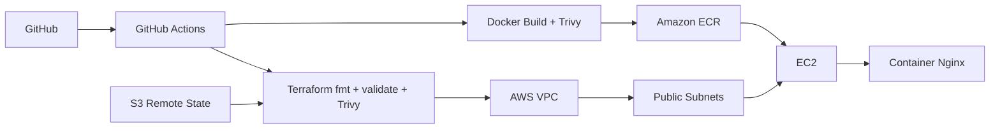

# AWS DevOps Infrastructure

Projeto de portfólio focado em **DevOps, Cloud e Infrastructure as Code**. A aplicação é propositalmente mínima: o objetivo principal é demonstrar provisionamento de infraestrutura AWS, containerização, automação, segurança e validação contínua.

## Arquitetura



## O que este projeto demonstra

- Terraform modularizado;
- AWS VPC com duas subnets públicas em zonas de disponibilidade diferentes;
- Internet Gateway e route table;
- EC2 com Amazon Linux 2023;
- acesso administrativo via AWS Systems Manager, sem porta SSH exposta;
- IMDSv2 obrigatório;
- volume raiz criptografado;
- Amazon ECR com scan de imagem e tags imutáveis;
- S3 para remote state com versionamento, criptografia e bloqueio público;
- state locking nativo do backend S3;
- Docker com container não privilegiado;
- health check;
- GitHub Actions;
- scan de vulnerabilidades e misconfigurations com Trivy;
- deployment opcional usando GitHub OIDC, sem access keys estáticas.

## Estrutura

```text
.
├── app/
│   ├── index.html
│   └── nginx.conf
├── terraform/
│   ├── bootstrap/
│   ├── environments/
│   │   └── dev/
│   └── modules/
│       ├── compute/
│       ├── network/
│       └── registry/
├── .github/workflows/
│   ├── ci.yml
│   └── deploy.yml
├── Dockerfile
└── README.md
```

## CI

Em pull requests e pushes para `main`, a pipeline executa:

```text
Docker build
   ↓
Container smoke test
   ↓
Trivy image scan

Terraform fmt
   ↓
terraform init -backend=false
   ↓
terraform validate
   ↓
Trivy IaC scan
```

A validação de Terraform não precisa de credenciais AWS porque a CI não executa `plan` ou `apply`.

## Testar o container localmente

```bash
docker build -t aws-devops-infrastructure .
docker run --rm -p 8080:8080 aws-devops-infrastructure
```

Health check:

```bash
curl http://localhost:8080/health
```

Resposta esperada:

```text
ok
```

## Remote state

Primeiro, crie o bucket de state:

```bash
cd terraform/bootstrap
terraform init
terraform apply
terraform output state_bucket_name
```

Depois copie o arquivo de exemplo:

```bash
cd ../environments/dev
cp backend.example.hcl backend.hcl
```

Substitua o nome do bucket em `backend.hcl` e inicialize:

```bash
terraform init -backend-config=backend.hcl
```

O backend S3 usa `use_lockfile = true`, evitando o uso do mecanismo antigo de locking via DynamoDB.

## Provisionar a infraestrutura

```bash
cd terraform/environments/dev
cp terraform.tfvars.example terraform.tfvars
terraform init -backend-config=backend.hcl
terraform plan
terraform apply
```

Recursos principais:

- VPC `10.20.0.0/16`;
- duas subnets públicas;
- ECR;
- Security Group HTTP;
- IAM Role + Instance Profile;
- EC2;
- SSM;
- container executado na instância.

> O projeto pode gerar custos na AWS. Sempre execute `terraform destroy` quando terminar um laboratório que não precisa permanecer ativo.

## Deploy pelo GitHub Actions

O workflow `deploy.yml` é manual e usa **OIDC**.

Configurações esperadas no GitHub:

### Secret

```text
AWS_DEPLOY_ROLE_ARN
TF_STATE_BUCKET
```

### Variable

```text
AWS_REGION=us-east-1
```

A role AWS usada pelo GitHub deve possuir uma trust policy para o OIDC provider do GitHub e apenas as permissões necessárias para o ambiente.

## Segurança

Algumas decisões intencionais:

- nenhuma chave AWS é armazenada no repositório;
- deploy usa OIDC;
- SSH não é aberto;
- EC2 usa SSM;
- IMDSv2 é obrigatório;
- EBS é criptografado;
- ECR faz scan de imagens;
- S3 de state possui versionamento e bloqueio de acesso público;
- containers rodam com imagem Nginx unprivileged.

O HTTP público na porta 80 é proposital para o laboratório e pode ser restringido através de `allowed_http_cidrs`.

## Por que existe uma aplicação tão simples?

Porque este é um projeto de **DevOps/Cloud**, não de desenvolvimento backend. A aplicação serve apenas como workload para demonstrar build, registry, infraestrutura, deployment, health checks e automação.

## Próximas evoluções

- Application Load Balancer + HTTPS;
- Route 53 + ACM;
- autoscaling;
- CloudWatch;
- ambiente `prod` separado;
- Terraform tests;
- políticas com OPA/Conftest;
- ECS ou EKS.

## Autor

**Rodrigo Serafim**

Foco em DevOps, Cloud, Python, Automação Industrial e IoT.
